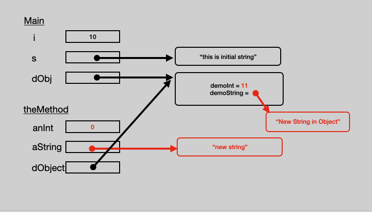

# CallByValueByReference

This is a simple demo intended to help explain call by value and call by reference using some pictures and the NetBeans debugger.

The final result just as theMethod returns is shown below.

.
